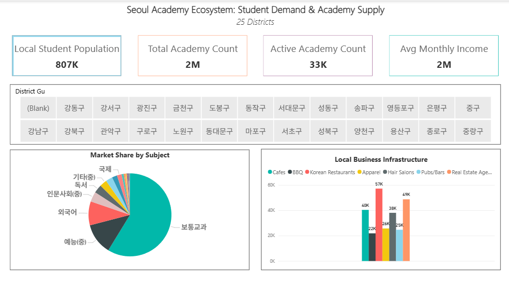

# seoul-education-market-analysis
An interactive Power BI dashboard tracking private academy capacity vs. student demographics and commercial ecosystems in Seoul.

# Seoul Private Education Market Analysis Dashboard

An interactive, data-driven Power BI application designed to evaluate market feasibility, student capacity gaps, and surrounding commercial ecosystems across Seoul's 25 districts.

## Interactive Visuals Preview

## Project Overview
This project blends public government datasets regarding Seoul's academic academy (Hagwon) infrastructure with localized household income data and regional business distribution counts. 

### Key Features Addressed:
* **Demand vs. Supply Alignment:** Compares local student populations directly against total certified academy seats.
* **Market Share Analysis:** Utilizes a custom Treemap to segment academy dominance by subject matter (e.g., General Studies, Arts, Foreign Languages).
* **Lifestyle Synergy Mapping:** Tracks adjacent commercial health (Cafes, Restaurants, Real Estate offices) to profile community characteristics.

## How to Use
1. Download the `Seoul_Hagwon_Market_Analysis.pbit` template file from this repository.
2. Open it using Power BI Desktop.
3. Use the **District Gu** interactive slicer to dynamically filter the entire canvas.
